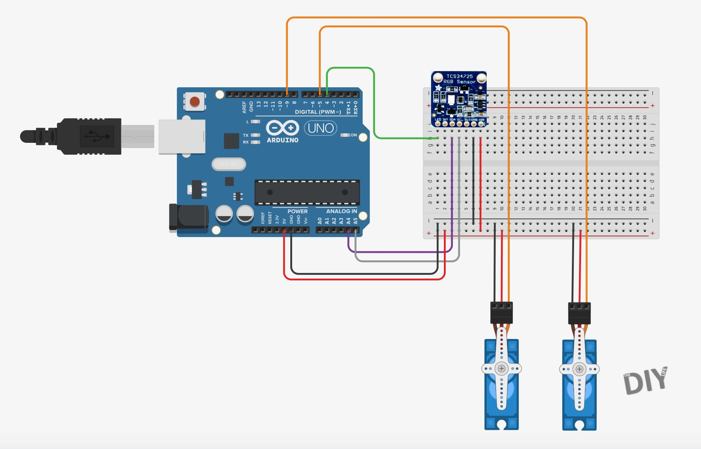

# ColourSorter
Arduino-based Skittles color sorter.  Sourced originally from Michael Klements / The DIY Life:

  https://www.the-diy-life.com/arduino-based-automatic-skittles-colour-sorter-make-your-own/

## Libraries

Requires the Adafruit TCS34725 library in addition to standard Arduino I2C and Servo libraries.

## Schematic

